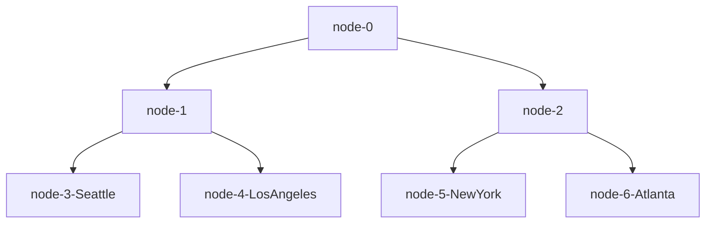
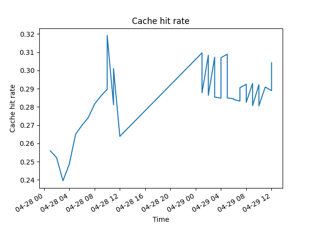
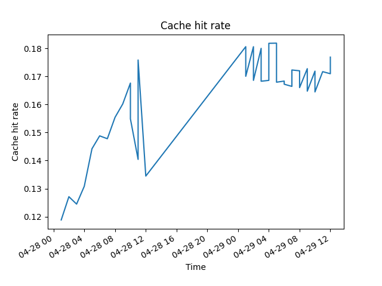
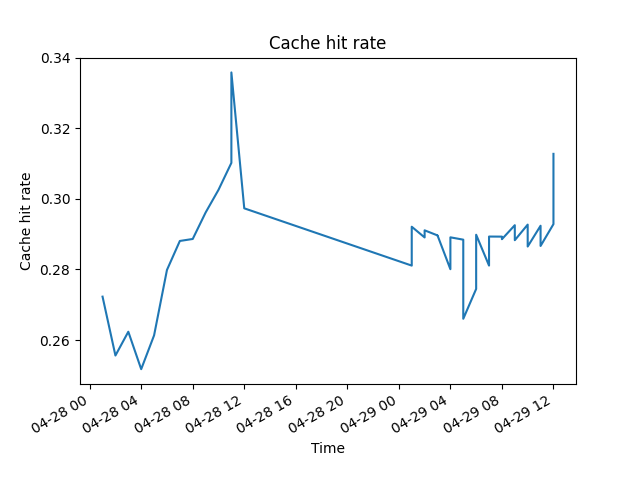
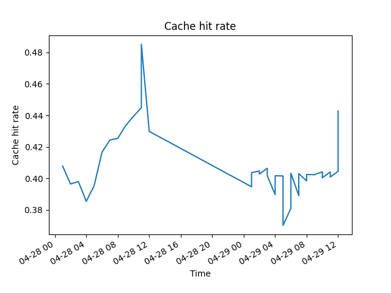

# SocialCDN Testbed

## Usage

The first step in conducting this experiment is that you need to acquire a sufficient number of nodes and assign them different roles. Here we take seven nodes as an example.

### 1. Define the topology

Here is the topology we use.



This topology can be denoted by ths `topology.json`

```json
{
    "topology" : {
        "layer-0" : [
            {
                "id" : "source-0",
                "name" : "source-site",
                "location" : [0, 0],
                "domain_name" : "",
                "ip_address" : ""
            }
        ],
        "layer-1" : [
            {
                "id" : "edge-0",
                "name" : "edge-0",
                "location" : [0, 0],
                "domain_name" : "",
                "ip_address" : "",
		"parent" : "source-0"
            },
            {
                "id" : "edge-1",
                "name" : "edge-1",
                "location" : [0, 0],
                "domain_name" : "",
                "ip_address" : "",
		"parent" : "source-0"
            }
        ],
        "layer-2" : [
            {
                "id" : "access-0",
                "name" : "access-0",
                "location" : [40.76, 111.84],
                "domain_name" : "",
                "ip_address" : "",
		"parent" : "edge-0"
            },
            {
                "id" : "access-1",
                "name" : "access-1",
                "location" : [43.07, 89.41],
                "domain_name" : "",
                "ip_address" : "",
		"parent" : "edge-0"
            },
            {
                "id" : "access-2",
                "name" : "access-2",
                "location" : [34.67, 82.84],
                "domain_name" : "",
                "ip_address" : "",
		"parent" : "edge-1"
            },
            {
                "id" : "access-3",
                "name" : "access-3",
                "location" : [0, 0],
                "domain_name" : "",
                "ip_address" : "",
		"parent" : "edge-1"
            }
        ]
    }

```

## Varnish使用指南


### varnish状态机


### 信息统计

**cache命中率**：`sudo varnishstat -1 | grep "cache"`

```bash
MAIN.cache_hit                     97817         0.14 Cache hits
MAIN.cache_hit_grace                 612         0.00 Cache grace hits
MAIN.cache_hitpass                     0         0.00 Cache hits for pass.
MAIN.cache_hitmiss                  6240         0.01 Cache hits for miss.
MAIN.cache_miss                   209296         0.30 Cache misses
MAIN.beresp_uncacheable            18346         0.03 Uncacheable backend responses

```

`varnishstat` 是 Varnish Cache 的一个实用程序，用于显示 Varnish 守护进程的统计信息。当你运行 `sudo varnishstat -1 | grep "cache"` 命令时，它将显示与缓存相关的统计数据。下面是输出结果的详细解释：

1. `MAIN.cache_hit`：这个计数器记录了请求直接从 Varnish 缓存中成功获取响应的次数。这里的 `97817` 表示有 97817 次缓存命中，而 `0.14` 可能表示这些命中占总请求的百分比。
2. `MAIN.cache_hit_grace`：这个计数器记录了那些尽管已经过期，但由于没有新的可用对象而仍然从缓存中提供响应的请求次数。`612` 表示有 612 次“宽限期命中”(也称为“优雅命中”)，`0.00` 表示这占总请求的百分比非常小。
3. `MAIN.cache_hitpass`：这个计数器记录了那些请求在 Varnish 缓存中没有找到合适对象，因此必须从后端服务器获取并绕过缓存直接提供给客户端的次数。`0` 表示没有发生这样的情况。
4. `MAIN.cache_hitmiss`：这个计数器记录了那些请求在 Varnish 缓存中找到了对象，但对象标记为“失踪”(miss)，这意味着尽管对象存在，但由于某些原因（如被标记为不适宜缓存)，Varnish 不能直接使用它，而必须再次验证后端。`6240` 表示有 6240 次这样的情况。
5. `MAIN.cache_miss`：这个计数器记录了请求在 Varnish 缓存中没有找到任何对象，因此必须向后端服务器发起请求以获取响应的次数。`209296` 表示有 209296 次缓存未命中，`0.30` 表示这占总请求的百分比。
6. `MAIN.beresp_uncacheable`：这个计数器记录了那些由后端服务器返回的响应被 Varnish 判断为不可缓存的次数。这可能是由于响应包含特定的头部，如 `Cache-Control: private`，指示响应不应被缓存。`18346` 表示有 18346 次这样的情况，`0.03` 表示这占总请求的百分比。

这些统计数据对于监控和优化 Varnish 缓存的性能非常有用。它们可以帮助你了解缓存的效率以及可能需要调整缓存策略的地方。

### Result







