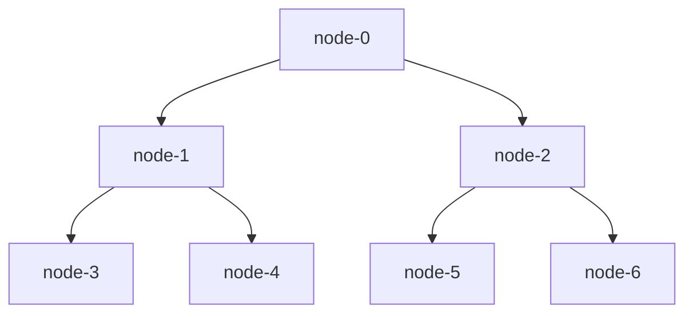

# SocialCDN Testbed

## Usage

The first step in conducting this experiment is that you need to acquire a sufficient number of nodes and assign them different roles. Here we take seven nodes as an example.

### 1. Define the topology

Here is the topology we use.




This topology can be denoted by ths `topology.json`

```json
{
    "topology" : {
        "layer-0" : [
            {
                "id" : "source-0",
                "name" : "source-site",
                "location" : [0, 0],
                "domain_name" : "",
                "ip_address" : ""
            }
        ],
        "layer-1" : [
            {
                "id" : "edge-0",
                "name" : "edge-0",
                "location" : [0, 0],
                "domain_name" : "",
                "ip_address" : "",
		"parent" : "source-0"
            },
            {
                "id" : "edge-1",
                "name" : "edge-1",
                "location" : [0, 0],
                "domain_name" : "",
                "ip_address" : "",
		"parent" : "source-0"
            }
        ],
        "layer-2" : [
            {
                "id" : "access-0",
                "name" : "access-0",
                "location" : [40.76, 111.84],
                "domain_name" : "",
                "ip_address" : "",
		"parent" : "edge-0"
            },
            {
                "id" : "access-1",
                "name" : "access-1",
                "location" : [43.07, 89.41],
                "domain_name" : "",
                "ip_address" : "",
		"parent" : "edge-0"
            },
            {
                "id" : "access-2",
                "name" : "access-2",
                "location" : [34.67, 82.84],
                "domain_name" : "",
                "ip_address" : "",
		"parent" : "edge-1"
            },
            {
                "id" : "access-3",
                "name" : "access-3",
                "location" : [0, 0],
                "domain_name" : "",
                "ip_address" : "",
		"parent" : "edge-1"
            }
        ]
    }

```

## Varnish使用指南

### 信息统计

**cache命中率**：`sudo varnishstat -1 | grep "cache`

```bash
MAIN.cache_hit                         5         0.01 Cache hits
MAIN.cache_hit_grace                   0         0.00 Cache grace hits
MAIN.cache_hitpass                     0         0.00 Cache hits for pass.
MAIN.cache_hitmiss                     0         0.00 Cache hits for miss.
MAIN.cache_miss                        4         0.01 Cache misses
MAIN.beresp_uncacheable                0         0.00 Uncacheable backend responses

```

`hit_ratio = cache_hit / (cache_hit + cache_miss) `

<style>#mermaid-1712813596066{font-family:sans-serif;font-size:16px;fill:#333;}#mermaid-1712813596066 .error-icon{fill:#552222;}#mermaid-1712813596066 .error-text{fill:#552222;stroke:#552222;}#mermaid-1712813596066 .edge-thickness-normal{stroke-width:2px;}#mermaid-1712813596066 .edge-thickness-thick{stroke-width:3.5px;}#mermaid-1712813596066 .edge-pattern-solid{stroke-dasharray:0;}#mermaid-1712813596066 .edge-pattern-dashed{stroke-dasharray:3;}#mermaid-1712813596066 .edge-pattern-dotted{stroke-dasharray:2;}#mermaid-1712813596066 .marker{fill:#333333;}#mermaid-1712813596066 .marker.cross{stroke:#333333;}#mermaid-1712813596066 svg{font-family:sans-serif;font-size:16px;}#mermaid-1712813596066 .label{font-family:sans-serif;color:#333;}#mermaid-1712813596066 .label text{fill:#333;}#mermaid-1712813596066 .node rect,#mermaid-1712813596066 .node circle,#mermaid-1712813596066 .node ellipse,#mermaid-1712813596066 .node polygon,#mermaid-1712813596066 .node path{fill:#ECECFF;stroke:#9370DB;stroke-width:1px;}#mermaid-1712813596066 .node .label{text-align:center;}#mermaid-1712813596066 .node.clickable{cursor:pointer;}#mermaid-1712813596066 .arrowheadPath{fill:#333333;}#mermaid-1712813596066 .edgePath .path{stroke:#333333;stroke-width:1.5px;}#mermaid-1712813596066 .flowchart-link{stroke:#333333;fill:none;}#mermaid-1712813596066 .edgeLabel{background-color:#e8e8e8;text-align:center;}#mermaid-1712813596066 .edgeLabel rect{opacity:0.5;background-color:#e8e8e8;fill:#e8e8e8;}#mermaid-1712813596066 .cluster rect{fill:#ffffde;stroke:#aaaa33;stroke-width:1px;}#mermaid-1712813596066 .cluster text{fill:#333;}#mermaid-1712813596066 div.mermaidTooltip{position:absolute;text-align:center;max-width:200px;padding:2px;font-family:sans-serif;font-size:12px;background:hsl(80,100%,96.2745098039%);border:1px solid #aaaa33;border-radius:2px;pointer-events:none;z-index:100;}#mermaid-1712813596066:root{--mermaid-font-family:sans-serif;}#mermaid-1712813596066:root{--mermaid-alt-font-family:sans-serif;}#mermaid-1712813596066 flowchart{fill:apa;}</style>
