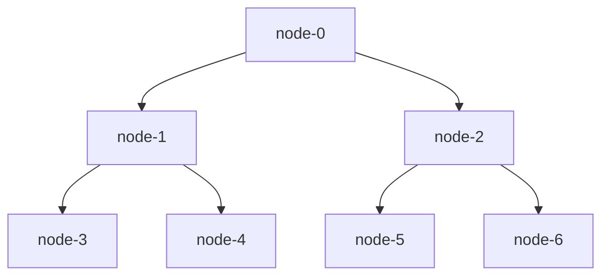

## SocialCDN

- 使用pintreest数据集
- wanted data

### Testbed

基于cloudlab和docker container的testbed

node-0是源站，即顶级服务器，保存所有的内容。

node-1, node-2 组成二级分发服务器

node-3,4,5,6 组成边缘内容分发服务器

### DataSet

allocation_table: 用于将每个用户分配到不同的testbed上的节点

| user_id | location | action_filename |
| ------- | -------- | --------------- |
| 1992    | US       | 1992_action.dat |
| 1003    | CN       | 1003_action.dat |

action_filename:

| usr_id | timestamp      | action_type | url                       |
| ------ | -------------- | ----------- | ------------------------- |
| 1992   | unix_timestamp | POST        | ftp://userid/filename.dat |
| 1000   |                | GET         |                           |
